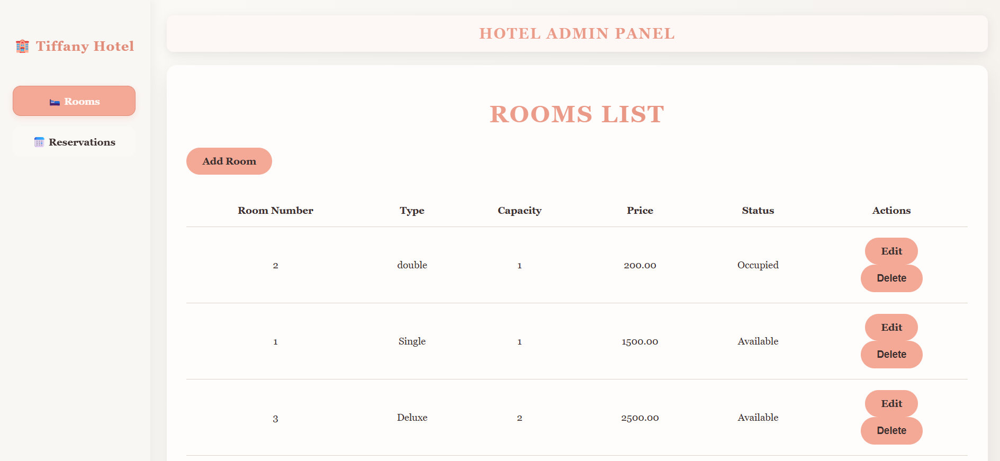
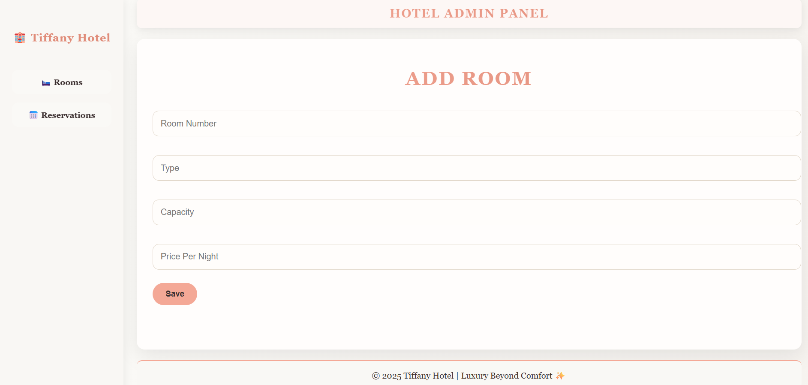
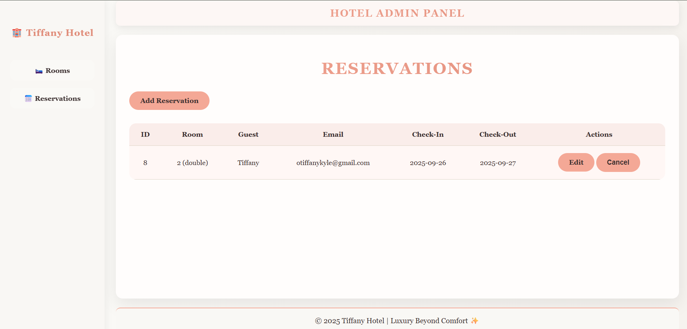
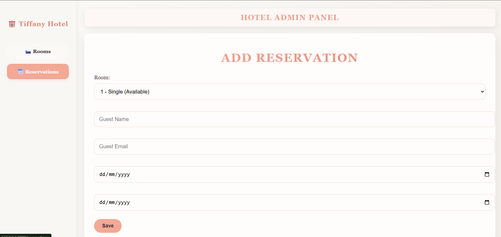

# Room Reservation System (Midterm Project)

A **Hotel Room Reservation Management System** built with **Laravel** that allows administrators to manage hotel rooms and reservations efficiently. This project focuses on **CRUD operations** for rooms and reservations, providing an intuitive interface for hotel admins to add, edit, update, or delete room records and manage guest bookings.

---

##  Description / Overview

This project is a **web-based Room Reservation System** designed for hotel management operations. The system is **admin-exclusive**, meaning only authorized administrators can access it. Admins can:

- Add new rooms (with details like room number, type, price, and status)
- Edit existing room details
- Delete rooms that are no longer available
- Add reservations for guests
- Manage, update, or cancel bookings

It demonstrates key **CRUD functionalities** using Laravel's MVC architecture and serves as a foundation for building more complex hotel management applications.

---

## 🎯 Objectives

- Apply **Laravel framework with PHP and MySQL** in developing a functional CRUD web system.
- Implement **database-driven operations** for hotel rooms and guest reservations.
- Strengthen skills in **MVC architecture, Eloquent ORM, and Blade templating**.
- Practice **admin-based system design** with role-restricted access.
- Enhance understanding of **data validation, error handling, migrations,** and **form management**.

---

## ⚙️ Features / Functionality

| Feature | Description |
|----------|-------------|
| **Room Management (CRUD)** | Add, edit, view, or delete room records with full details. |
| **Reservation Management** | Admin can create, view, update, and cancel guest reservations. |
| **Database Migrations** | Structured database schema using Laravel migrations. |
| **Eloquent Relationships** | Defines relationships between the Room and Reservation models (One-to-Many).|
| **Validation** | Server-side validation for room details and reservation forms. |
| **Responsive UI** | Clean interface built with CSS |
| **Database Integration** | Fully integrated with MySQL for persistent data storage. |

---

## 🧰 Installation Instructions

### 🖥️ Prerequisites
- **XAMPP** or **WAMP** server (or any local PHP development environment)
- **PHP ≥ 8.0**
- **Composer** (Dependency Manager)
- **MySQL Database**
- **Laravel ≥ 9.x**
- **Web Browser** (Chrome, Edge, Firefox)

### 🔧 Steps

1. **Clone or Download the Repository**
```bash
   git clone https://github.com/tiffanyk22/GitHub-Collaboration.git
   cd roomReservation
```

2. **Install Dependencies**
```bash
   composer install
```

3. **Copy Environment File**
```bash
   cp .env.example .env
```

4. **Generate Application Key**
```bash
   php artisan key:generate
```

5. **Configure Database in `.env`**
```env
   DB_CONNECTION=mysql
   DB_HOST=127.0.0.1
   DB_PORT=3306
   DB_DATABASE=myhotel
   DB_USERNAME=root
   DB_PASSWORD=
```

6. **Run Database Migrations**
```bash
   php artisan migrate
```

7. **(Optional) Seed Sample Data**
```bash
   php artisan db:seed
```

8. **Start the Development Server**
```bash
   php artisan serve
```

9. **Open in Browser**
```
   http://127.0.0.1:8000
```

---

## 📂 Project Structure

```
ROOMRESERVATION/
│
├── app/
│   ├── Http/
│   │   └── Controllers/
│   │       ├── Controller.php
│   │       ├── ReservationController.php
│   │       └── RoomController.php
│   │
│   ├── Models/
│   │   ├── Reservation.php
│   │   ├── Room.php
│   │   └── User.php
│   │
│   └── Providers/
│
├── bootstrap/
├── config/
├── database/
│   ├── factories/
│   ├── migrations/
│   │   ├── 0001_01_01_000000_create_users_table.php
│   │   ├── 0001_01_01_000001_create_cache_table.php
│   │   ├── 0001_01_01_000002_create_jobs_table.php
│   │   ├── 2025_09_20_173928_create_rooms_table.php
│   │   └── 2025_09_20_174009_create_reservations_table.php
│   │
│   └── seeders/
│
├── public/
│   ├── css/
│   │   └── styles.css
│   ├── .htaccess
│   ├── favicon.ico
│   └── index.php
│
├── routes/
│   ├── console.php
│   └── web.php
│
├── .gitignore
├── database.sqlite
└── composer.json
```

---

## 🚀 Usage

### **Admin Dashboard (`/`)**
- View overview of rooms and reservations at a glance.
- Access navigation to manage rooms and reservations.

### **Rooms Section (`/rooms`)**
- **View All Rooms:** Display list of all hotel rooms with details.
- **Add Room:** Click "Add Room" button to create a new room entry.
- **Edit and Update Room:** Click "Edit" to modifyand update room details (room number, type, price, status).
- **Delete Room:** Click "Delete" to remove a room from the system.

### **Reservations Section (`/reservations`)**
- **View All Reservations:** Display list of all guest reservations.
- **Add Reservation:** Click "Add Reservation" to create a new booking (select room, guest details, check-in/out dates).
- **Edit and Update Reservation:** Click "Edit" to update reservation details.
- **Cancel Reservation:** Click "Cancel" or "Delete" to remove a booking.

---

## 📸 Screenshots

### Rooms Management Page


### Add New Room Form


### Reservations Management Page


### Add New Reservation Form


---

## 💻 Code Snippets

### 🧩 Room Model – Database Structure

**File:** `app/Models/Room.php`

This snippet shows the Room model with fillable attributes and relationship to reservations.
```php
<?php

namespace App\Models;

use Illuminate\Database\Eloquent\Factories\HasFactory;
use Illuminate\Database\Eloquent\Model;

class Room extends Model
{
    use HasFactory;

    protected $fillable = [
        'roomNumber', 'type', 'capacity', 'pricePerNight', 'status'
    ];

    public function reservations()
    {
        return $this->hasMany(Reservation::class);
    }
}
```

---

### 🧩 Reservation Model – Relationship with Room

**File:** `app/Models/Reservation.php`

This snippet shows the Reservation model and its relationship to the Room model.
```php
<?php

namespace App\Models;

use Illuminate\Database\Eloquent\Factories\HasFactory;
use Illuminate\Database\Eloquent\Model;

class Reservation extends Model
{
    use HasFactory;

    protected $fillable = [
        'room_id',
        'guestName',
        'guestEmail',
        'checkInDate',
        'checkOutDate'
    ];

    public function room()
    {
        return $this->belongsTo(Room::class);
    }
}

```

---

### 🔍 Room Controller – Index and Store Methods

**File:** `app/Http/Controllers/RoomController.php`
```php
<?php

namespace App\Http\Controllers;

use App\Models\Room;
use Illuminate\Http\Request;

class RoomController extends Controller
{
    public function index()
    {
        $rooms = Room::all();
        return view('rooms.index', compact('rooms'));
    }

    public function create()
    {
        return view('rooms.create');
    }

    public function store(Request $request)
    {
        $request->validate([
            'roomNumber' => 'required|unique:rooms',
            'type' => 'required',
            'capacity' => 'required|integer',
            'pricePerNight' => 'required|numeric',
        ]);

        Room::create($request->all());
        return redirect()->route('rooms.index')->with('success', 'Room added successfully!');
    }

    public function edit(Room $room)
    {
        return view('rooms.edit', compact('room'));
    }

    public function update(Request $request, Room $room)
    {
        $request->validate([
            'roomNumber' => 'required|unique:rooms,roomNumber,' . $room->id,
            'type' => 'required',
            'capacity' => 'required|integer',
            'pricePerNight' => 'required|numeric',
        ]);

        $room->update($request->all());
        return redirect()->route('rooms.index')->with('success', 'Room updated successfully!');
    }

    public function destroy(Room $room)
    {
        $room->delete();
        return redirect()->route('rooms.index')->with('success', 'Room deleted successfully!');
    }
}

```

---

### 📄 Rooms Table Migration

**File:** `database/migrations/2025_09_20_173928_create_rooms_table.php`
```php
<?php

use Illuminate\Database\Migrations\Migration;
use Illuminate\Database\Schema\Blueprint;
use Illuminate\Support\Facades\Schema;

return new class extends Migration
{
    /**
     * Run the migrations.
     */
    public function up(): void
{
    Schema::create('rooms', function (Blueprint $table) {
        $table->id();
        $table->string('roomNumber')->unique();
        $table->string('type');
        $table->string('status')->default('Available'); // Available / Occupied
        $table->timestamps();
    });
}


    /**
     * Reverse the migrations.
     */
    public function down(): void
    {
        Schema::dropIfExists('rooms');
    }
};

```

---

### 📄 Reservations Table Migration

**File:** `database/migrations/2025_09_20_174009_create_reservations_table.php`
```php
<?php

use Illuminate\Database\Migrations\Migration;
use Illuminate\Database\Schema\Blueprint;
use Illuminate\Support\Facades\Schema;

return new class extends Migration
{
    /**
     * Run the migrations.
     */
    public function up(): void
{
    Schema::create('reservations', function (Blueprint $table) {
        $table->id();
        $table->foreignId('room_id')->constrained('rooms')->onDelete('cascade');
        $table->string('guestName');
        $table->string('guestEmail');
        $table->date('checkInDate');
        $table->date('checkOutDate');
        $table->timestamps();
    });
}


    /**
     * Reverse the migrations.
     */
    public function down(): void
    {
        Schema::dropIfExists('reservations');
    }
};

```

---

## 🛠️ Technologies Used

- **Backend:** Laravel 9.x (PHP Framework)
- **Database:** MySQL
- **Frontend:** Blade Templates, HTML5, CSS3, Bootstrap
- **Server:** Apache (XAMPP/WAMP)
- **Version Control:** Git

---

## 🤝 Contributors

- **Names:** Tiffany Kyle Olivar and Vhianzhy Xuivern Dumpit
- **Section:** 4-B

---

## 📝 License

This project is developed for educational purposes as part of a midterm project requirement and an activity for final term.

---

## 📞 Contact

For questions or feedback, please contact:
- **Email:** [otiffanykyle@gmail.com]
- **GitHub:** [https://github.com/tiffanyk22](https://github.com/tiffanyk22)

---

**Thank you for checking out the Room Reservation System!** 🏨✨
